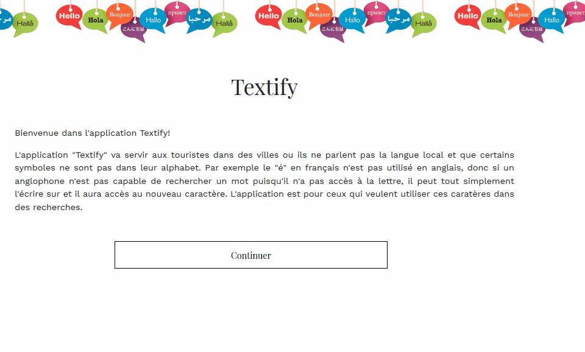
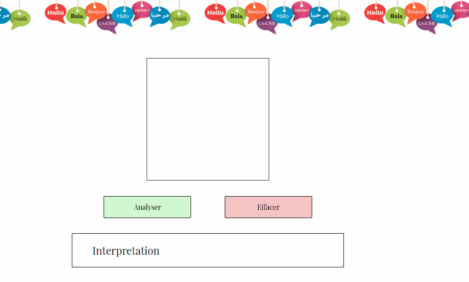
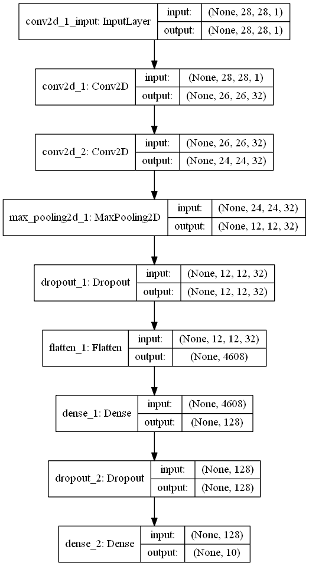

# Textify

## A simple character recognition app

Have you ever been to a city in a city with signs written in a language whose characters you can't even type out? Don't worry!

With Textify, you can simply draw the characters that are unfamiliar to you, and get a text output that you can copy-paste into any dictionnary.

The application works using a convolutional neural network trained with MNIST data. This was already available in Keras, so it was easiest to use it for our minimum viable product. However, this dataset only includes digits, meaning that our application will only detect digits between 0 and 9 for the moment.

Moving forward, we would like to train our CNN with more data such as handwritten roman characters, kanji, kana, etc.

## In Action!

### The main page for our app:

### Trying out some digits:

### The CNN visualized:

## Running the app

Our app has a HTML/javascript front-end with a Flask REST API back-end. To run the back-end, simply install the files from backend/requirements.txt

Keras is crucial to make the back-end functional, as our CNN was built using Keras. Simply create the environment 'tensorflow' by running:

conda create --name tensorflow

The environment.yml can be found in the root directory.

**Note: We worked on this as part of Hackatown 2018. However, the CNN was built following a tutorial (linked in the Jupyter Notebook) which I had followed prior to the hackathon.**
